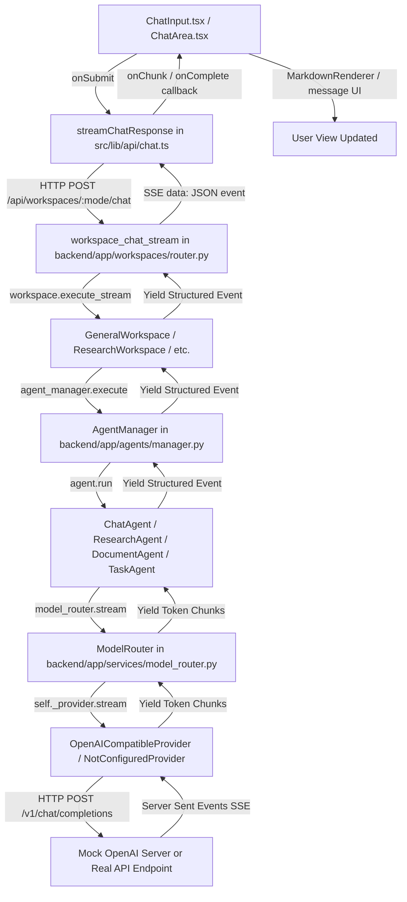

# NOVA AI Request Pipeline Audit

This document details the complete end-to-end request pipeline for NOVA AI, analyzing how messages flow from the user interface to the LLM and back, and identifying where mock responses leak.

## 1. End-to-End Flowchart



---

## 2. Pipeline Stage Details

### Stage 1: Frontend User Input & Trigger
*   **Component**: `ChatInput.tsx` (lines 494–509) renders the input area and handles the submit action.
*   **Controller**: `page.tsx` contains `handleSendMessage` (lines 669–713) which creates a `Message` object and passes history to `executeResponseStream` (lines 338–638).
*   **API Wrapper**: `streamChatResponse` in `src/lib/api/chat.ts` (lines 45–227) formats the message history, maps parameters to the FastAPI request body, and sends a `POST` request to `/api/workspaces/{mode}/chat`.

### Stage 2: Backend Streaming Route
*   **Router**: `workspace_chat_stream` in `backend/app/workspaces/router.py` (lines 58–215).
*   **Actions**:
    1.  Resolves or creates the conversation record in the database.
    2.  Validates and persists the user message in the database.
    3.  Retrieves message history.
    4.  Calls `workspace.execute_stream(...)` to obtain an async generator of agent event dicts.
    5.  Wraps the generator inside a `StreamingResponse` using standard SSE (`data: {json_event}\n\n`).

### Stage 3: Workspace & Agent Selection
*   **Workspace**: E.g., `GeneralWorkspace` in `backend/app/workspaces/general.py`.
*   **Orchestration**: Calls `agent_manager.execute(...)` (in `backend/app/agents/manager.py`).
*   **Selection**: Resolves the agent subclass based on the active mode (e.g., `ChatAgent` for general chat, `ResearchAgent` for research, etc.).
*   **Execution**: Executes `agent.run(state, db=db)`.

### Stage 4: Agent Run & Prompt Formulation
*   **Agent**: E.g., `ChatAgent` in `backend/app/agents/chat_agent.py`.
*   **System Instructions**: Calls `_get_system_prompt_for_mode()` which fetches workspace system prompts (e.g. from `backend/app/services/workspace_prompts.py`).
*   **Router Call**: Calls `model_router.stream(payload, purpose="fast", temperature=0.7)` with system instructions prepended to user messages.

### Stage 5: Model Routing & LLM Provider Execution
*   **Router**: `ModelRouter` in `backend/app/services/model_router.py`.
*   **Provider**: Resolves the LLM provider based on settings:
    *   If `settings.ai_is_real` is `True` -> `OpenAICompatibleProvider`.
    *   If `settings.AI_USE_MOCK` is `True` -> `MockLLMProvider`.
    *   Otherwise -> `NotConfiguredProvider` (raises a clear error).
*   **HTTP Call**: `OpenAICompatibleProvider` (in `backend/app/services/llm_provider.py`) sends a request to `{AI_BASE_URL}/chat/completions` with headers `Authorization: Bearer {AI_API_KEY}`.

---

## 3. Configuration Guardrails (`settings.ai_is_real`)

The critical configuration property is `ai_is_real` defined in `backend/app/core/config.py`:

```python
@property
def ai_is_real(self) -> bool:
    """True only when a valid non-placeholder API key is configured AND mock is not forced."""
    placeholder_keys = ("", "your_llm_api_key_here", "dummy-local-key", None)
    return (
        not self.AI_USE_MOCK
        and self.AI_API_KEY not in placeholder_keys
        and bool(self.AI_API_KEY)
    )
```

### Handling of Keys:
*   **Empty / None**: Evaluated as `False`. The backend routes to `NotConfiguredProvider`, raising an immediate configuration error.
*   **Placeholder Key** (e.g., `"dummy-local-key"`): Evaluated as `False`. Chat fails with a configuration error instead of returning mock fallback answers.
*   **Valid Key**: Evaluated as `True`. Routes to `OpenAICompatibleProvider`.

---

## 4. Leakage of Mock Responses (The "Why")

### The Current Behavior
When the local workspace is configured with `AI_API_KEY=local-mock-key` and `AI_BASE_URL=http://localhost:8005/v1`, the backend evaluates `settings.ai_is_real` as `True` (since `local-mock-key` is not in the placeholder list). It routes the request to the `OpenAICompatibleProvider` which sends a request to the mock OpenAI completion server (`mock_openai_server.py`) running locally.

### The Leakage Root Cause
In `mock_openai_server.py` (lines 52–56):
```python
match_key = user_prompt.lower().replace('"', '')
response_text = PROMPTS_RESPONSES.get(
    match_key,
    f"I received your message: '{user_prompt}'. How can I assist you further?"
)
```
1.  **Exact Matching Limitations**: The mock completions server maps incoming user requests to canned replies using a hardcoded dictionary (`PROMPTS_RESPONSES`).
2.  **Default Fallback**: If the prompt fails to match exactly (due to casing, punctuation like periods, or phrasing differences), the mock server falls back to:
    `"I received your message: '{user_prompt}'. How can I assist you further?"`
3.  **Echo Leaking**: This echo reply is returned to the `OpenAICompatibleProvider` as SSE chunks, which streams it to the user.
