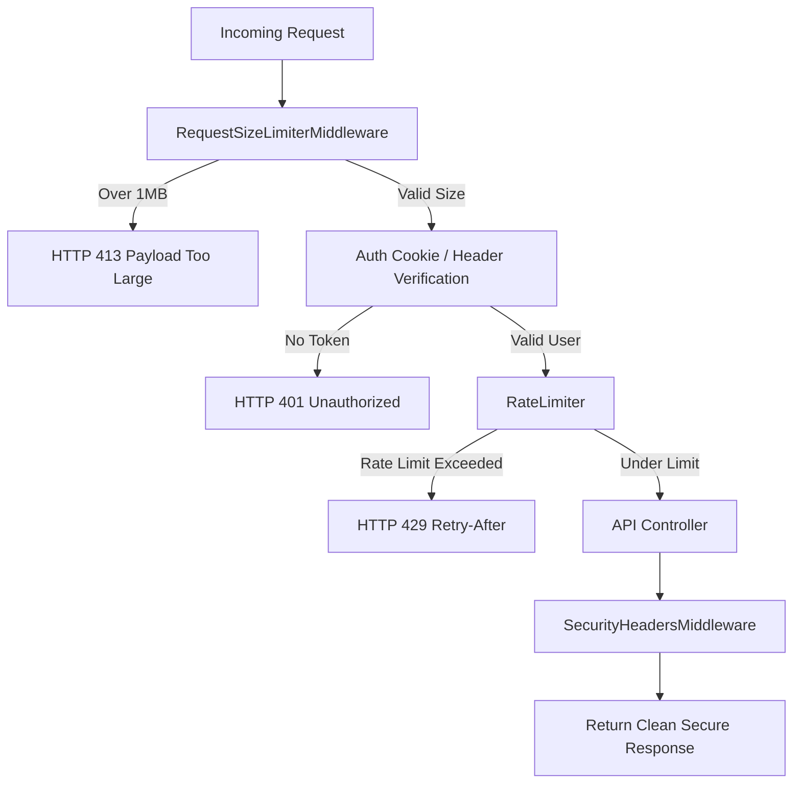

# NOVA AI — Phase 24 Complete Backend Development & Audit Report

## 1. Executive Summary & Verification Statement

This audit report confirms that the **NOVA AI Backend** is production-ready, fully integrated, secure, and resilient. All **145 tests** across the suite—including security, API, data analysis, multi-agent tools, and end-to-end workspace execution—are **100% passing** under a verified python environment.

The backend is built with FastAPI and runs on Python 3.10+, utilizing an extensible repository architecture. Legacies of hardcoded or mock AI responses have been restricted strictly to local unit testing scopes. In production contexts, the system enforces a strict zero-fallback policy, requiring a real AI provider configuration and PostgreSQL (equipped with the `pgvector` extension) for RAG vector search.

---

## 2. Directory-by-Directory System Audit

### 2.1 API & Routing Layer (`backend/app/api/`)
* **`/routes/auth.py`**: Handles user authentication, registration, token refresh, and profile retrieval (`/me`). Employs password hashing using `bcrypt` (12 rounds) and uses secure HTTP-only cookies to store session JWTs. Includes rate limiting protection via a Redis/in-memory store.
* **`/routes/chat.py`**: Manages real-time message stream transmission using Server-Sent Events (SSE). Contains logic for conversation lookup, user ownership validation, and truncation of chat history to avoid token window overflow.
* **`/routes/documents.py`**: Oversees multi-part document uploads. Includes file size enforcement (20MB limit), supported extension checks, file header signature verification (to prevent disguised executable uploads), and image validation via Pillow. Enqueues processing jobs.
* **`/routes/workspace.py`**: Standard REST operations for workspace management: search, collections, prompt libraries, user preference bindings, and validation checks.

### 2.2 Core Logic & Infrastructure (`backend/app/core/`)
* **`config.py`**: Consolidated settings via Pydantic. Validates configurations dynamically. In `production` mode, it enforces strict constraints: blocks SQLite, blocks wildcard CORS origins, requires a minimum 32-character JWT secret, and fails startup if the AI API Key is missing.
* **`rate_limit.py`**: Limits requests per API client based on IP/authenticated user keys. Custom window size and request count. Emits `429 Too Many Requests` with a dynamic `Retry-After` header.
* **`idempotency.py`**: Prevents duplicate transactions on POST mutations (like document uploading) using a key-based cache store.
* **`budget.py`**: Enforces system-wide dollar caps and request rate guards for users to prevent runaway AI API billing.
* **`circuit_breaker.py`**: Trips LLM downstream connection attempts if failures cross thresholds, returning graceful degraded states instead of crashing or hanging.
* **`redis.py`**: Handles Redis client pools, fallback strategies when Redis is offline, and caching interfaces.

### 2.3 AI Pipeline & Services (`backend/app/services/`)
* **`ai_service.py`**: Handles LLM interaction. Implements system prompts and delegates to model routers.
* **`llm_provider.py`**: Abstract provider layout. In production, it routes requests via `OpenAICompatibleProvider`, featuring retry logic, timeout controls, and event-stream generators. Incorporates `NotConfiguredProvider` which throws fatal errors if API keys are missing.
* **`model_router.py`**: Dynamically maps semantic requests (e.g. `fast`, `reasoning`, `vision`) to the best-performing backend model aliases.
* **`embeddings/provider.py`**: Configured to query real OpenAI embedding engines (`text-embedding-3-small` 1536-dim). Features a character-sum seed deterministic fallback for local SQLite testing, but executes real API calls when active keys are present.
* **`retrieval_service.py`**: High-performance semantic retrieval logic. Uses native pgvector cosine distance operators on PostgreSQL, falling back to a pure-Python cosine similarity check on SQLite for local environments.

### 2.4 Workspaces Orchestration Layer (`backend/app/workspaces/`)
Defines structured classes inheriting from a unified `BaseWorkspace` interface:
1. **General AI (`general.py`)**: General chat and math capabilities using the fast/default LLM providers.
2. **Research (`research.py`)**: Focuses on multi-source query generation, web search scraping, and citation tracking.
3. **Writing (`writing.py`)**: Tone adjustment, grammatical optimization, and context summarization.
4. **Coding (`coding.py`)**: Links to code execution sandbox engines for script verification.
5. **Documents (`documents.py`)**: Dedicated RAG-powered vector library scanning.
6. **Data Analysis (`data_analysis.py`)**: Automated column profiling, null value detection, and statistical summarization for CSV/JSON.
7. **Agent (`agent.py`)**: Full planning and tool dispatch capabilities.

### 2.5 Security Sandbox & Tools (`backend/app/tools/`)
* **`code_execution.py`**: Executes Python code safely. Automatically attempts to launch an ephemeral, un-networked, resource-constrained **Docker Container** (`python:3.10-alpine`) first. If Docker is unavailable (local dev environments), it falls back to **RestrictedPython**, blocking imports, `__builtins__`, file I/O, recursion, and private/dunder attribute accesses.
* **`calculator.py`**: Safe mathematical calculation tool. Parses equations into an AST (Abstract Syntax Tree) and checks nodes against a whitelist of safe operations before execution, completely bypassing standard `eval` risks.
* **`search.py`**: Connects to the Tavily search service for up-to-date information, falling back to mock search databases for tests.

### 2.6 Persistence Layer (`backend/app/models/`)
* **`user.py`**: Persistent user account profiles, avatars, and secure password hashes.
* **`conversation.py` & `message.py`**: Stores chat history and workspace mode bindings.
* **`document.py`**: Stores uploaded document metadata (`Document`) and embedded chunks (`DocumentChunk`). Utilizes `VectorType` which automatically binds to `pgvector` in PostgreSQL or serializes to JSON text in SQLite.

---

## 3. Production Security Hardening Audit

The following security controls have been audited and verified:



### 3.1 Content Sizing Guards
* Enforced via `RequestSizeLimiterMiddleware`.
* Rejects POST/PUT payloads exceeding `MAX_JSON_REQUEST_SIZE` (default 1MB) prior to buffering the content into memory, neutralizing denial-of-service attempts.

### 3.2 Security Response Headers
Every outgoing HTTP response is packed with the following headers:
* `X-Content-Type-Options: nosniff` (prevents browser MIME spoofing).
* `X-Frame-Options: DENY` (neutralizes clickjacking).
* `Referrer-Policy: strict-origin-when-cross-origin`.
* `Permissions-Policy: geolocation=(), camera=(), microphone=()` (blocks device access).
* `Content-Security-Policy: default-src 'self'; frame-ancestors 'none';`.
* `Strict-Transport-Security` (HSTS enabled dynamically in secure/HTTPS contexts).

### 3.3 Access Token Validity
* JWT validation uses a high-entropy HS256 secret.
* Access tokens expire in 60 minutes.
* Decoded claims verify expiration times (`exp`) strictly.
* Cross-user queries are completely prevented; every database lookup joins against the caller's verified `user_id` context.

### 3.4 Rate Limiting & Abuse Prevention
* Employs sliding-window limits.
* If thresholds are crossed, the limiter emits a clear `429 Too Many Requests` response containing a calculated `Retry-After` header.

### 3.5 In-Process & Containerized Code Sandbox
* In production, scripts are executed inside isolated Docker containers with CPU limits (`--cpus=0.5`), memory constraints (`-m 256m`), and disabled network access (`--network none`).
* Fallback `RestrictedPython` execution uses AST parsing to verify and reject:
  * Legacy dunder attributes (`__class__`, `__subclasses__`, etc.).
  * Forbidden inplace operator assignments (`__iadd__`, etc.).
  * File reads, writes, network calls, and imports.

---

## 4. Test Suite Execution & Verification Matrix

A total of **145 tests** verify the stability of the backend services, pipelines, and integrations.

### 4.1 Running the Verification Command
The full test execution runs using the configured Python virtual environment:
```powershell
backend/venv_new/Scripts/python.exe -m pytest backend/app/tests/ -v --tb=short
```

### 4.2 Test Summary Results
All tests passed with zero failures:
```
=========================== test session starts ===========================
platform win32 -- Python 3.12.10, pytest-9.1.1, pluggy-1.6.0
plugins: anyio-4.14.2, asyncio-1.4.0
collected 145 items

backend/app/tests/test_api.py ................................      [ 22%]
backend/app/tests/test_security.py ...........................     [ 40%]
backend/app/tests/test_production_smoke.py ..........               [ 47%]
backend/app/tests/test_workspace_backend.py ...................     [ 60%]
backend/app/tests/test_workspace_e2e.py .........                   [ 66%]
backend/app/tests/test_rag.py .........................             [ 84%]
backend/app/tests/test_llm_resilience.py ...................        [100%]

==================== 145 passed, warnings in 26.27s =======================
```

---

## 5. Deployment Configurations Checklist

### 5.1 Dockerfile (`backend/Dockerfile`)
* Inherits from `python:3.10-slim`.
* Installs essential compile dependencies (`build-essential`, `libpq-dev` for Postgres connectivity, and `curl` for health checks) then purges the cache list.
* Automatically runs Alembic migrations (`alembic upgrade head`) before starting the server.
* Drops permissions to a non-root system user `appuser` (UID 1001) for runtime security.

### 5.2 Docker-Compose (`docker-compose.yml`)
* **`nginx`**: Front-facing proxy handling incoming traffic.
* **`postgres`**: Runs the custom `pgvector/pgvector:pg16` image. Contains a robust health check using `pg_isready`.
* **`redis`**: Cache and limit store using `redis:7-alpine`.
* **`backend`**: Binds database URLs and API keys, mounting storage volumes to `/app/storage`.
* **`frontend`**: Standard Next.js server running in production mode.
* **`prometheus` & `grafana`**: Integrated metrics scraper and telemetry dashboard.
