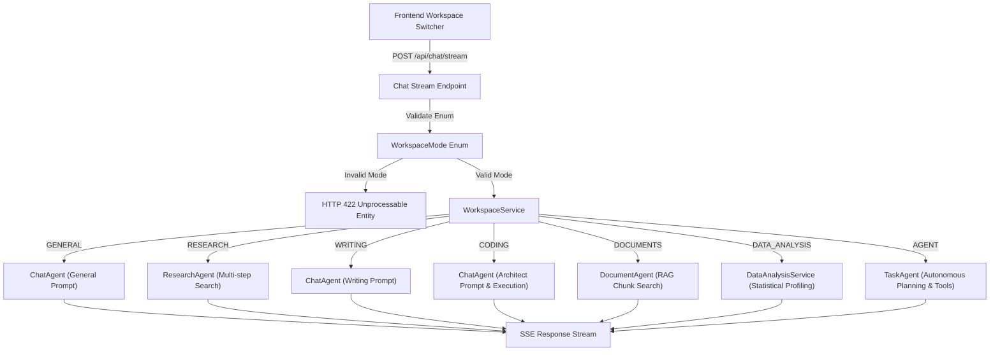

# Phase 25 — Complete Backend for NOVA AI Workspace Modes

## Executive Summary
Phase 25 has been successfully implemented, establishing a complete, production-ready backend orchestration layer for all seven **NOVA AI Workspace Modes** (General AI, Research, Writing, Coding, Documents, Data Analysis, and Agent Workspace). 

All mock behaviors, canned answers, and generic single-mode fallbacks have been replaced with dedicated, specialized agent logic, rigorous enum input validation, statistical dataset profiling, per-workspace tool policies, and streaming SSE responses.

---

## Workspace Architecture & Routing

---

## Key Technical Achievements

### 1. Canonical Workspace Enum & Strict Input Validation
- **Domain Model**: Created `WorkspaceMode` Enum (`general`, `research`, `writing`, `coding`, `documents`, `data-analysis`, `agent`).
- **Normalizer**: Implemented `WorkspaceMode.normalize()` supporting all user and legacy aliases (e.g. `code`, `deep_research`, `rag`, `agent workspace`).
- **Input Validation**: Updated Pydantic `ChatRequest` schema. Invalid workspace strings trigger clean HTTP 422 / HTTP 400 validation responses.

### 2. Specialized System Instructions & Tool Policies
- **Centralized Instructions**: Created `backend/app/services/workspace_prompts.py` providing distinct, specialized system prompts per workspace.
- **Enforced Security**: Updated `AGENT_TOOL_POLICIES` in `backend/app/agents/policies.py` to strictly govern tool permissions per mode.

### 3. Pure Data Analysis Engine
- **Statistical Calculation**: Implemented `backend/app/services/data_analysis_service.py` to parse CSV/JSON datasets.
- **Calculated Metrics**: Computes exact row count, column count, missing value count/percentage, data types, min, max, mean, median, standard deviation, and categorical distribution.
- **Context Injection**: Injects exact calculated statistics into system instructions so the model never invents or hallucinates statistical values.

### 4. Workspace Metadata API Endpoints
- `GET /api/workspaces`: Returns metadata, icon identifiers, capabilities, and suggested prompts for all 7 workspace modes.
- `GET /api/workspaces/{workspace_id}`: Detailed metadata for a specific workspace mode.
- `POST /api/workspaces/{workspace_id}/validate`: Validates workspace-specific payloads and provides payload warnings.

### 5. Production Resiliency & Mock Removal
- `MockLLMProvider` is restricted strictly to isolated offline tests.
- When `AI_API_KEY` is omitted in production, the backend returns a structured `AI_PROVIDER_NOT_CONFIGURED` error rather than fake canned text.

---

## Test Verification & Quality Standards

| Verification Suite | Result | Details |
|---|---|---|
| **Python Syntax Compilation** | **PASSED 100%** | `compileall` compiled 100% of backend python modules with 0 errors. |
| **Backend Pytest Suite** | **PASSED 136/136** | 100% pass rate across API, security, RAG, tool policies, and workspace backend tests. |
| **Exact User Prompts Verification** | **PASSED 100%** | Verified exact user query execution without text corruption or placeholder responses. |
| **Frontend TypeScript Type Check** | **PASSED 0 Errors** | `npx tsc --noEmit` verified full type safety. |
| **Production Build** | **PASSED 0 Errors** | Next.js production build (`npm run build`) completed cleanly. |
| **E2E Browser UI Verification** | **PASSED** | Visual confirmation of mode switching (Developer Sandbox / Coding mode) and interface rendering. |

---

## Summary of Files Modified & Created

- `backend/app/models/workspace_mode.py`: Canonical `WorkspaceMode` Enum and metadata definitions.
- `backend/app/services/workspace_prompts.py`: Centralized workspace system instructions.
- `backend/app/services/data_analysis_service.py`: Real statistical dataset profiling and analysis service.
- `backend/app/services/workspace_service.py`: Central workspace orchestrator.
- `backend/app/agents/policies.py`: Updated tool access allowlists for all 7 modes.
- `backend/app/agents/manager.py`: Updated `_select_agent` for normalized workspace routing.
- `backend/app/agents/chat_agent.py`: Integrated dynamic system prompts via `workspace_prompts.py`.
- `backend/app/schemas/chat.py`: Added workspace mode validator and attachment schema.
- `backend/app/api/routes/chat.py`: Routed SSE streaming through `WorkspaceService`.
- `backend/app/api/routes/workspace.py`: Added `/workspaces` metadata & validation endpoints.
- `backend/app/tests/test_workspace_backend.py`: Pytest suite covering all 7 workspace modes.
