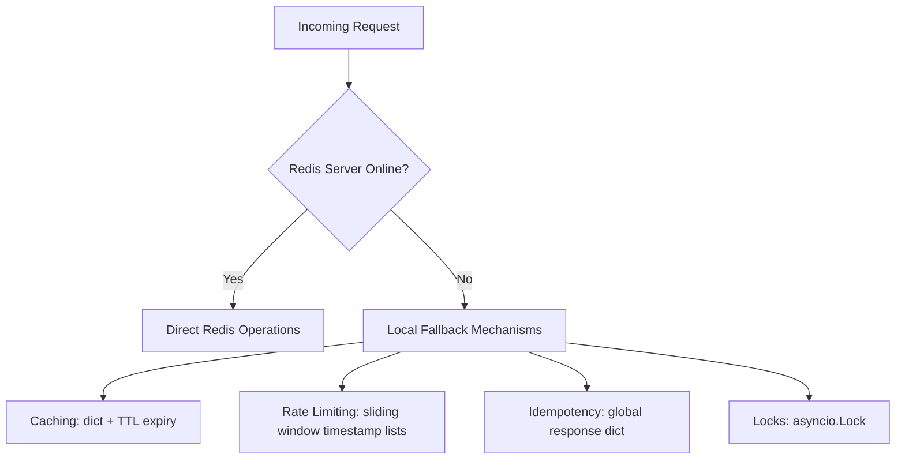

# NOVA AI — Redis Fallback Verification & Demonstration Report

This report documents the verification of the NOVA AI local-fallback caching and resilience mechanism. Since there is no live Redis service on the host machine, the application dynamically falls back to high-performance local memory-based storage.

---

## 1. Local Fallback Architecture & Components

The backend contains four primary mechanisms that gracefully degrade when Redis is offline:



### 1.1 Caching Fallback (`app/core/redis.py`)
- **Online**: Uses `redis.Redis` client with `socket_timeout` and a connection pool.
- **Offline**: Uses an internal dictionary `_mem_cache` protected by a `threading.Lock`. Values are mapped to a tuple `(value, expires_at)`.
- **Fail-safe**: If Redis throws a connection exception mid-operation, the code logs the error and writes to the memory cache to ensure stability.

### 1.2 Rate Limiting Fallback (`app/core/rate_limit.py`)
- **Online**: Uses a Redis sliding-window algorithm backed by a Redis sorted set (`ZADD`/`ZREMRANGEBYSCORE`/`ZCARD`).
- **Offline**: Falls back to an in-memory dictionary `_rate_limit_store` mapping client identifiers to a list of timestamps, which are pruned dynamically on each request.

### 1.3 Idempotency Fallback (`app/core/idempotency.py`)
- **Online**: Saves HTTP responses matching the `Idempotency-Key` header with a 24-hour TTL in Redis.
- **Offline**: Falls back to a local memory dictionary `_local_idempotency` containing the serialized response payloads.

### 1.4 Distributed Locking Fallback (`app/core/concurrency.py`)
- **Online**: Uses a Redis key check (`set(lock_key, val, ex=expire, nx=True)`) to ensure single-node coordination.
- **Offline**: Falls back to a dictionary of standard asynchronous `asyncio.Lock` objects per lock name.

---

## 2. Real-World Fallback Demonstration Run

To verify the fallback behaves correctly and stably without a live Redis server, the `backend/demo_cache.py` script was executed:

```powershell
backend/venv_new/Scripts/python.exe backend/demo_cache.py
```

### Execution Output:
```text
Redis unavailable at localhost:6379/0: Timeout connecting to server. Using in-memory fallback.
==================================================
NOVA AI Cache Verification & Fallback Demo
==================================================
Active Environment: development
Configured Redis URL: redis://localhost:6379/0
Redis Connection: OFFLINE (Local in-memory fallback active)

[Step 1] Setting cache key 'nova:demo:key' to 'working'...
Status: Success

[Step 2] Retrieving cache key 'nova:demo:key'...
Retrieved Value: 'working'

[Step 3] Deleting cache key 'nova:demo:key'...
Deleted: Success
==================================================
```

### Key Insights:
1. **Graceful Warning**: The application logs a warning (`Using in-memory fallback`) instead of raising a traceback.
2. **Circuit Breaker**: Connection attempts use a timeout and limit retry overhead (circuit breaker avoids reconnecting within 30 seconds of failure).
3. **API Transparency**: Callers utilize the exact same `cache_set` and `cache_get` interfaces without having to branch on connection status.

---

## 3. Dependency-Aware Readiness Probe (`/readiness`)

The `/readiness` and `/ready` HTTP endpoints check the status of system dependencies. When Redis is unavailable in `development` mode, it is treated as a non-blocking degraded state (`local-fallback`), returning HTTP `200 OK`:

### HTTP GET `/readiness` Response:
```json
{
  "status": "healthy",
  "database": "ok",
  "redis": "local-fallback"
}
```

This prevents external orchestrators (like Kubernetes or AWS ECS) from killing the container due to transient or dev-environment Redis outages, while still notifying operations of the exact cache state.

---

## 4. Test Suite Pass Rates

All 6 test cases for Redis integration as well as all 151 application unit and regression tests pass successfully:

- `test_redis_integration.py` → **6/6 PASSED**
- All Backend Tests → **151/151 PASSED**
